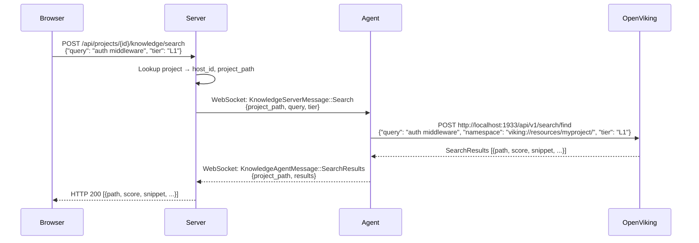
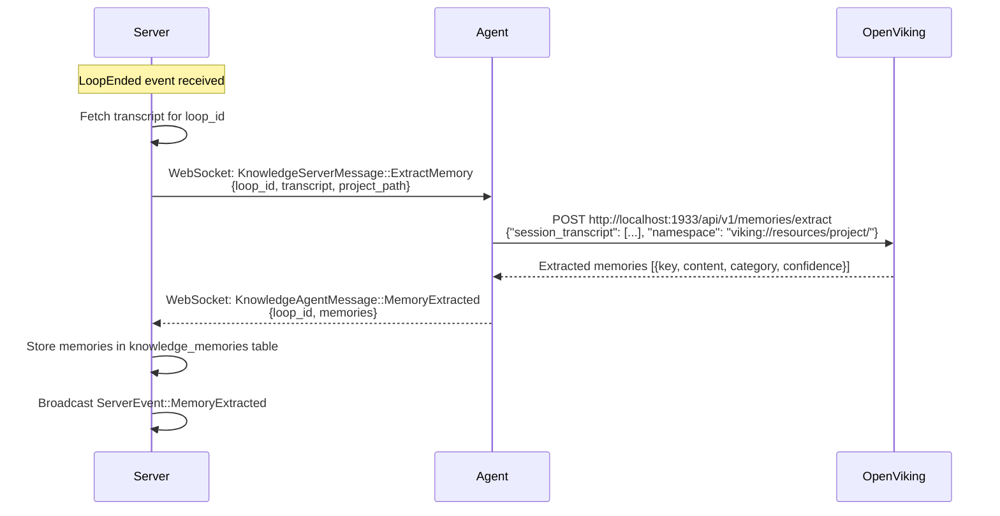

# RFC: OpenViking Integration for ZRemote

## Status: Draft
## Date: 2026-03-15

---

## 1. Overview & Motivation

### Problem

ZRemote manages remote machines with terminal sessions and agentic loop monitoring, but lacks persistent knowledge about the projects running on those machines. Each time an agentic loop starts, it has zero context about prior work, common patterns, or accumulated insights for that project.

### Solution

Integrate [OpenViking](https://github.com/openviking/openviking) as a per-host knowledge base service. OpenViking provides semantic search, memory extraction, and knowledge synthesis over project files and agentic session transcripts.

### What OpenViking Provides

- **Semantic indexing** of project files (code, docs, configs)
- **Memory extraction** from conversation transcripts
- **Tiered search** (L0 exact, L1 semantic, L2 exploratory)
- **Knowledge synthesis** for generating project instructions
- **LiteLLM integration** for unified LLM provider access

### Why Per-Host (Not Per-Project)

A single OpenViking instance runs on each host, shared across all projects on that host. Projects are namespaced via `viking://resources/{project_name}/` URIs. Benefits:

- Single process to manage per host (simpler lifecycle)
- Shared embedding model cache across projects
- Lower memory footprint vs. N instances
- Cross-project search when needed (e.g., "find all API auth patterns across my projects")

---

## 2. Architecture

### Component Interaction

```
┌─────────────────────────────────────────────────────────────────────┐
│ Browser (React)                                                     │
│  ┌──────────────────┐  ┌───────────────┐  ┌──────────────────────┐ │
│  │ KnowledgePanel   │  │ MemoryTimeline│  │ InstructionGenerator │ │
│  └────────┬─────────┘  └──────┬────────┘  └──────────┬───────────┘ │
│           │                   │                      │             │
│           └───────────────────┼──────────────────────┘             │
│                               │ HTTP REST                          │
└───────────────────────────────┼────────────────────────────────────┘
                                │
┌───────────────────────────────┼────────────────────────────────────┐
│ Server (Axum)                 │                                    │
│  ┌────────────────────────────┴──────────────────────────────────┐ │
│  │ routes/knowledge.rs                                           │ │
│  │  GET  /api/projects/{id}/knowledge/status                     │ │
│  │  POST /api/projects/{id}/knowledge/index                      │ │
│  │  POST /api/projects/{id}/knowledge/search                     │ │
│  │  GET  /api/projects/{id}/knowledge/memories                   │ │
│  │  POST /api/projects/{id}/knowledge/extract                    │ │
│  │  POST /api/projects/{id}/knowledge/generate-instructions      │ │
│  │  POST /api/hosts/{id}/knowledge/service                       │ │
│  └────────────────────────────┬──────────────────────────────────┘ │
│                               │                                    │
│  ┌──────────────────┐  ┌──────┴──────┐  ┌───────────────────────┐ │
│  │ knowledge_bases  │  │ WebSocket   │  │ knowledge_memories    │ │
│  │ (SQLite)         │  │ relay       │  │ (SQLite)              │ │
│  └──────────────────┘  └──────┬──────┘  └───────────────────────┘ │
└───────────────────────────────┼────────────────────────────────────┘
                                │ WebSocket (AgentMessage / ServerMessage)
┌───────────────────────────────┼────────────────────────────────────┐
│ Agent (on remote host)        │                                    │
│  ┌────────────────────────────┴──────────────────────────────────┐ │
│  │ knowledge/mod.rs - KnowledgeManager                           │ │
│  │  ┌──────────────┐  ┌──────────────┐  ┌─────────────────────┐ │ │
│  │  │ process.rs   │  │ client.rs    │  │ config.rs           │ │ │
│  │  │ OV lifecycle │  │ HTTP client  │  │ ov.conf generation  │ │ │
│  │  └──────┬───────┘  └──────┬───────┘  └─────────────────────┘ │ │
│  │         │                 │                                   │ │
│  └─────────┼─────────────────┼───────────────────────────────────┘ │
│            │                 │ HTTP localhost:1933                  │
│  ┌─────────┴─────────────────┴───────────────────────────────────┐ │
│  │ OpenViking process                                             │ │
│  │  /api/v1/search/find                                           │ │
│  │  /api/v1/resources/index                                       │ │
│  │  /api/v1/memories/extract                                      │ │
│  │  /api/v1/knowledge/synthesize                                  │ │
│  │  /health                                                       │ │
│  │                          ┌────────────────────────────────────┐ │ │
│  │                          │ LiteLLM (unified LLM proxy)       │ │ │
│  │                          │  → OpenAI / Gemini / OpenRouter   │ │ │
│  │                          └────────────────────────────────────┘ │ │
│  └────────────────────────────────────────────────────────────────┘ │
└────────────────────────────────────────────────────────────────────┘
```

### Data Flow: Search Request



### Data Flow: Memory Extraction from Agentic Loop



---

## 3. LLM Provider Strategy

### LiteLLM as Unified Proxy

OpenViking supports LiteLLM natively as a provider. LiteLLM acts as a unified interface to multiple LLM providers, meaning the agent only needs to configure one provider in `ov.conf` and use model prefixes to route to the desired backend.

### Supported Providers

| Provider | LiteLLM Model Prefix | Example Embedding Model | Example VLM Model |
|---|---|---|---|
| OpenAI | (none - default) | `text-embedding-3-small` | `gpt-4o` |
| Gemini | `gemini/` | `gemini/text-embedding-004` | `gemini/gemini-2.0-flash` |
| OpenRouter | `openrouter/` | `openrouter/openai/text-embedding-3-small` | `openrouter/anthropic/claude-sonnet-4` |

### Configuration Flow

```
User sets in ZRemote UI:
  openviking.provider = "gemini"
  openviking.api_key = "AIza..."
  openviking.embedding_model = "text-embedding-004"
  openviking.vlm_model = "gemini-2.0-flash"

Agent generates ov.conf:
  [provider]
  type = "litellm"
  api_key = "AIza..."

  [models]
  embedding = "gemini/text-embedding-004"    # prefix auto-applied
  vlm = "gemini/gemini-2.0-flash"           # prefix auto-applied
```

### Provider-to-Prefix Mapping (Agent-side)

```rust
fn model_prefix(provider: &str) -> &str {
    match provider {
        "openai" => "",
        "gemini" => "gemini/",
        "openrouter" => "openrouter/",
        _ => "",
    }
}
```

---

## 4. Phase 1: Protocol + Agent Lifecycle

### 4.1 Protocol Messages

New file: `crates/zremote-protocol/src/knowledge.rs`

Following the existing pattern from `agentic.rs`:

```rust
use chrono::{DateTime, Utc};
use serde::{Deserialize, Serialize};
use uuid::Uuid;

use crate::AgenticLoopId;

pub type KnowledgeBaseId = Uuid;

/// Status of the OpenViking service on a host.
#[derive(Debug, Clone, Copy, Serialize, Deserialize, PartialEq, Eq)]
#[serde(rename_all = "snake_case")]
pub enum KnowledgeServiceStatus {
    Starting,
    Ready,
    Indexing,
    Error,
    Stopped,
}

/// Status of an indexing operation.
#[derive(Debug, Clone, Copy, Serialize, Deserialize, PartialEq, Eq)]
#[serde(rename_all = "snake_case")]
pub enum IndexingStatus {
    Queued,
    InProgress,
    Completed,
    Failed,
}

/// Search result tier.
#[derive(Debug, Clone, Copy, Serialize, Deserialize, PartialEq, Eq)]
#[serde(rename_all = "snake_case")]
pub enum SearchTier {
    L0, // Exact match
    L1, // Semantic similarity
    L2, // Exploratory / cross-project
}

/// Category of extracted memory.
#[derive(Debug, Clone, Copy, Serialize, Deserialize, PartialEq, Eq)]
#[serde(rename_all = "snake_case")]
pub enum MemoryCategory {
    Pattern,
    Decision,
    Pitfall,
    Preference,
    Architecture,
    Convention,
}

/// A single search result.
#[derive(Debug, Clone, Serialize, Deserialize, PartialEq)]
pub struct SearchResult {
    pub path: String,
    pub score: f64,
    pub snippet: String,
    pub line_start: Option<u32>,
    pub line_end: Option<u32>,
    pub tier: SearchTier,
}

/// An extracted memory from a transcript.
#[derive(Debug, Clone, Serialize, Deserialize, PartialEq)]
pub struct ExtractedMemory {
    pub key: String,
    pub content: String,
    pub category: MemoryCategory,
    pub confidence: f64,
    pub source_loop_id: AgenticLoopId,
}

/// Knowledge messages sent from agent to server.
#[derive(Debug, Clone, Serialize, Deserialize, PartialEq)]
#[serde(tag = "type", content = "payload")]
pub enum KnowledgeAgentMessage {
    ServiceStatus {
        status: KnowledgeServiceStatus,
        version: Option<String>,
        error: Option<String>,
    },
    KnowledgeBaseReady {
        project_path: String,
        total_files: u64,
        total_chunks: u64,
    },
    IndexingProgress {
        project_path: String,
        status: IndexingStatus,
        files_processed: u64,
        files_total: u64,
        error: Option<String>,
    },
    SearchResults {
        project_path: String,
        request_id: Uuid,
        results: Vec<SearchResult>,
        duration_ms: u64,
    },
    MemoryExtracted {
        loop_id: AgenticLoopId,
        memories: Vec<ExtractedMemory>,
    },
    InstructionsGenerated {
        project_path: String,
        content: String,
        memories_used: u32,
    },
}

/// Knowledge messages sent from server to agent.
#[derive(Debug, Clone, Serialize, Deserialize, PartialEq)]
#[serde(tag = "type", content = "payload")]
pub enum KnowledgeServerMessage {
    ServiceControl {
        action: ServiceAction,
    },
    IndexProject {
        project_path: String,
        force_reindex: bool,
    },
    Search {
        project_path: String,
        request_id: Uuid,
        query: String,
        tier: SearchTier,
        max_results: Option<u32>,
    },
    ExtractMemory {
        loop_id: AgenticLoopId,
        project_path: String,
        transcript: Vec<TranscriptFragment>,
    },
    GenerateInstructions {
        project_path: String,
    },
}

/// Service lifecycle action.
#[derive(Debug, Clone, Copy, Serialize, Deserialize, PartialEq, Eq)]
#[serde(rename_all = "snake_case")]
pub enum ServiceAction {
    Start,
    Stop,
    Restart,
}

/// Minimal transcript fragment for memory extraction.
#[derive(Debug, Clone, Serialize, Deserialize, PartialEq)]
pub struct TranscriptFragment {
    pub role: String,
    pub content: String,
    pub timestamp: DateTime<Utc>,
}
```

### 4.2 Protocol Integration

Add wrapper variants to existing enums in `terminal.rs`:

```rust
// In AgentMessage enum:
KnowledgeAction(KnowledgeAgentMessage),

// In ServerMessage enum:
KnowledgeAction(KnowledgeServerMessage),
```

This follows the existing pattern of `AgenticAction(AgenticServerMessage)`.

Update `lib.rs`:

```rust
pub mod knowledge;
pub use knowledge::*;
```

### 4.3 Agent Knowledge Module

New module: `crates/zremote-agent/src/knowledge/`

```
knowledge/
  mod.rs        - KnowledgeManager, message routing
  process.rs    - OpenViking subprocess lifecycle
  client.rs     - HTTP client to OV API
  config.rs     - ov.conf generation
```

#### `process.rs` - Subprocess Lifecycle

```rust
/// Manages the OpenViking subprocess.
pub struct OvProcess {
    child: Option<tokio::process::Child>,
    port: u16,
    data_dir: PathBuf,
    config_path: PathBuf,
    health_check_interval: Duration,
}

impl OvProcess {
    /// Spawn OpenViking as a child process.
    /// Expects `openviking` binary to be in PATH.
    pub async fn start(&mut self) -> Result<()> {
        let child = tokio::process::Command::new("openviking")
            .arg("serve")
            .arg("--config")
            .arg(&self.config_path)
            .arg("--port")
            .arg(self.port.to_string())
            .arg("--data-dir")
            .arg(&self.data_dir)
            .stdout(std::process::Stdio::piped())
            .stderr(std::process::Stdio::piped())
            .kill_on_drop(true)
            .spawn()?;

        self.child = Some(child);
        self.wait_for_healthy().await?;
        Ok(())
    }

    /// Health check: GET http://localhost:{port}/health
    async fn wait_for_healthy(&self) -> Result<()> {
        let url = format!("http://localhost:{}/health", self.port);
        for attempt in 0..30 {
            tokio::time::sleep(Duration::from_millis(500)).await;
            if let Ok(resp) = reqwest::get(&url).await {
                if resp.status().is_success() {
                    return Ok(());
                }
            }
            tracing::debug!(attempt, "OV health check pending");
        }
        Err(anyhow::anyhow!("OpenViking failed to become healthy"))
    }

    /// Graceful shutdown: SIGTERM, wait 5s, then SIGKILL.
    pub async fn stop(&mut self) -> Result<()> {
        if let Some(ref mut child) = self.child {
            // Send SIGTERM
            nix::sys::signal::kill(
                nix::unistd::Pid::from_raw(child.id().unwrap() as i32),
                nix::sys::signal::Signal::SIGTERM,
            )?;

            // Wait up to 5 seconds
            match tokio::time::timeout(
                Duration::from_secs(5),
                child.wait()
            ).await {
                Ok(_) => {},
                Err(_) => { child.kill().await?; }
            }
            self.child = None;
        }
        Ok(())
    }
}
```

#### `config.rs` - Configuration Generation

```rust
/// Generate ov.conf from ZRemote config values.
pub fn generate_ov_conf(
    provider: &str,
    api_key: &str,
    embedding_model: &str,
    vlm_model: &str,
    port: u16,
    data_dir: &Path,
) -> String {
    let prefix = model_prefix(provider);
    format!(
        r#"[server]
port = {port}
data_dir = "{data_dir}"

[provider]
type = "litellm"
api_key = "{api_key}"

[models]
embedding = "{prefix}{embedding_model}"
vlm = "{prefix}{vlm_model}"

[indexing]
chunk_size = 1024
chunk_overlap = 128
exclude_patterns = ["*.lock", "node_modules/**", "target/**", ".git/**", "*.pyc"]

[search]
default_tier = "L1"
max_results = 20
"#,
        data_dir = data_dir.display()
    )
}

fn model_prefix(provider: &str) -> &str {
    match provider {
        "openai" => "",
        "gemini" => "gemini/",
        "openrouter" => "openrouter/",
        _ => "",
    }
}
```

#### `client.rs` - HTTP Client

```rust
/// HTTP client for the local OpenViking API.
pub struct OvClient {
    client: reqwest::Client,
    base_url: String,
}

impl OvClient {
    pub fn new(port: u16) -> Self {
        Self {
            client: reqwest::Client::builder()
                .timeout(Duration::from_secs(30))
                .build()
                .expect("failed to build HTTP client"),
            base_url: format!("http://localhost:{port}"),
        }
    }

    pub async fn health(&self) -> Result<bool> { /* GET /health */ }

    pub async fn index_project(
        &self, namespace: &str, path: &str, force: bool
    ) -> Result<IndexingResponse> {
        // POST /api/v1/resources/index
    }

    pub async fn search(
        &self, namespace: &str, query: &str, tier: &str, max_results: u32
    ) -> Result<Vec<SearchResultResponse>> {
        // POST /api/v1/search/find
    }

    pub async fn extract_memories(
        &self, namespace: &str, transcript: &[TranscriptFragment]
    ) -> Result<Vec<MemoryResponse>> {
        // POST /api/v1/memories/extract
    }

    pub async fn synthesize_knowledge(
        &self, namespace: &str
    ) -> Result<SynthesisResponse> {
        // POST /api/v1/knowledge/synthesize
    }
}
```

#### `mod.rs` - KnowledgeManager

```rust
/// Orchestrates OpenViking lifecycle and message handling.
pub struct KnowledgeManager {
    process: OvProcess,
    client: OvClient,
    server_tx: mpsc::Sender<AgentMessage>,
    enabled: bool,
}

impl KnowledgeManager {
    /// Handle a KnowledgeServerMessage from the server.
    pub async fn handle_message(&mut self, msg: KnowledgeServerMessage) {
        match msg {
            KnowledgeServerMessage::ServiceControl { action } => {
                match action {
                    ServiceAction::Start => self.start_service().await,
                    ServiceAction::Stop => self.stop_service().await,
                    ServiceAction::Restart => {
                        self.stop_service().await;
                        self.start_service().await;
                    }
                }
            }
            KnowledgeServerMessage::IndexProject { project_path, force_reindex } => {
                self.index_project(&project_path, force_reindex).await;
            }
            KnowledgeServerMessage::Search { project_path, request_id, query, tier, max_results } => {
                self.search(&project_path, request_id, &query, tier, max_results).await;
            }
            KnowledgeServerMessage::ExtractMemory { loop_id, project_path, transcript } => {
                self.extract_memory(loop_id, &project_path, &transcript).await;
            }
            KnowledgeServerMessage::GenerateInstructions { project_path } => {
                self.generate_instructions(&project_path).await;
            }
        }
    }
}
```

### 4.4 Agent Integration

In `connection.rs`, add routing for the new message type:

```rust
// In the message handling match:
ServerMessage::KnowledgeAction(km) => {
    if let Some(ref mut knowledge_mgr) = knowledge_manager {
        knowledge_mgr.handle_message(km).await;
    } else {
        tracing::warn!("received knowledge message but OV is not configured");
    }
}
```

---

## 5. Phase 2: Server-side + Indexing

### 5.1 Database Migration

New file: `crates/zremote-server/migrations/005_knowledge.sql`

```sql
CREATE TABLE knowledge_bases (
    id TEXT PRIMARY KEY,
    host_id TEXT NOT NULL REFERENCES hosts(id) ON DELETE CASCADE,
    status TEXT NOT NULL DEFAULT 'stopped',
    openviking_version TEXT,
    last_error TEXT,
    started_at TEXT,
    updated_at TEXT NOT NULL DEFAULT (strftime('%Y-%m-%dT%H:%M:%SZ', 'now')),
    UNIQUE(host_id)
);

CREATE TABLE knowledge_indexing (
    id TEXT PRIMARY KEY,
    project_id TEXT NOT NULL REFERENCES projects(id) ON DELETE CASCADE,
    status TEXT NOT NULL DEFAULT 'queued',
    files_processed INTEGER DEFAULT 0,
    files_total INTEGER DEFAULT 0,
    started_at TEXT NOT NULL DEFAULT (strftime('%Y-%m-%dT%H:%M:%SZ', 'now')),
    completed_at TEXT,
    error TEXT
);

CREATE INDEX idx_knowledge_indexing_project_id ON knowledge_indexing(project_id);

CREATE TABLE knowledge_memories (
    id TEXT PRIMARY KEY,
    project_id TEXT NOT NULL REFERENCES projects(id) ON DELETE CASCADE,
    loop_id TEXT REFERENCES agentic_loops(id) ON DELETE SET NULL,
    key TEXT NOT NULL,
    content TEXT NOT NULL,
    category TEXT NOT NULL DEFAULT 'pattern',
    confidence REAL NOT NULL DEFAULT 0.0,
    created_at TEXT NOT NULL DEFAULT (strftime('%Y-%m-%dT%H:%M:%SZ', 'now')),
    updated_at TEXT NOT NULL DEFAULT (strftime('%Y-%m-%dT%H:%M:%SZ', 'now'))
);

CREATE INDEX idx_knowledge_memories_project_id ON knowledge_memories(project_id);
CREATE INDEX idx_knowledge_memories_loop_id ON knowledge_memories(loop_id);
CREATE INDEX idx_knowledge_memories_category ON knowledge_memories(category);

-- FTS for memory content search
CREATE VIRTUAL TABLE knowledge_memories_fts USING fts5(
    key,
    content,
    content='knowledge_memories',
    content_rowid='rowid'
);

CREATE TRIGGER knowledge_memories_fts_insert AFTER INSERT ON knowledge_memories BEGIN
    INSERT INTO knowledge_memories_fts(rowid, key, content) VALUES (new.rowid, new.key, new.content);
END;

CREATE TRIGGER knowledge_memories_fts_delete AFTER DELETE ON knowledge_memories BEGIN
    INSERT INTO knowledge_memories_fts(knowledge_memories_fts, rowid, key, content)
        VALUES ('delete', old.rowid, old.key, old.content);
END;
```

### 5.2 Server Routes

New file: `crates/zremote-server/src/routes/knowledge.rs`

Following the pattern from `routes/projects.rs`:

```rust
// Response types (with sqlx::FromRow for DB queries)

#[derive(Debug, Serialize, Deserialize, sqlx::FromRow)]
pub struct KnowledgeBaseResponse {
    pub id: String,
    pub host_id: String,
    pub status: String,
    pub openviking_version: Option<String>,
    pub last_error: Option<String>,
    pub started_at: Option<String>,
    pub updated_at: String,
}

#[derive(Debug, Serialize, Deserialize, sqlx::FromRow)]
pub struct MemoryResponse {
    pub id: String,
    pub project_id: String,
    pub loop_id: Option<String>,
    pub key: String,
    pub content: String,
    pub category: String,
    pub confidence: f64,
    pub created_at: String,
    pub updated_at: String,
}

#[derive(Debug, Serialize, Deserialize, sqlx::FromRow)]
pub struct IndexingResponse {
    pub id: String,
    pub project_id: String,
    pub status: String,
    pub files_processed: i64,
    pub files_total: i64,
    pub started_at: String,
    pub completed_at: Option<String>,
    pub error: Option<String>,
}
```

#### Endpoints

| Method | Path | Description |
|---|---|---|
| `GET` | `/api/projects/{id}/knowledge/status` | Get KB status for a project's host |
| `POST` | `/api/projects/{id}/knowledge/index` | Trigger indexing for a project |
| `POST` | `/api/projects/{id}/knowledge/search` | Semantic search over project knowledge |
| `GET` | `/api/projects/{id}/knowledge/memories` | List extracted memories for project |
| `POST` | `/api/projects/{id}/knowledge/extract` | Trigger memory extraction from a loop |
| `POST` | `/api/projects/{id}/knowledge/generate-instructions` | Generate CLAUDE.md content |
| `POST` | `/api/hosts/{id}/knowledge/service` | Control OV service (start/stop/restart) |

#### Route Registration

In `main.rs`, add to the router:

```rust
// Knowledge routes
.route("/api/projects/{id}/knowledge/status", get(knowledge::get_status))
.route("/api/projects/{id}/knowledge/index", post(knowledge::trigger_index))
.route("/api/projects/{id}/knowledge/search", post(knowledge::search))
.route("/api/projects/{id}/knowledge/memories", get(knowledge::list_memories))
.route("/api/projects/{id}/knowledge/extract", post(knowledge::extract_memories))
.route("/api/projects/{id}/knowledge/generate-instructions",
    post(knowledge::generate_instructions))
.route("/api/hosts/{id}/knowledge/service", post(knowledge::control_service))
```

### 5.3 Agent Message Handling (Server-side)

In `routes/agents.rs`, handle incoming `KnowledgeAgentMessage` variants:

```rust
AgentMessage::KnowledgeAction(km) => match km {
    KnowledgeAgentMessage::ServiceStatus { status, version, error } => {
        // Upsert knowledge_bases row
        // Broadcast ServerEvent::KnowledgeStatusChanged
    }
    KnowledgeAgentMessage::IndexingProgress { project_path, status, files_processed, files_total, error } => {
        // Update knowledge_indexing row
        // Broadcast ServerEvent::IndexingProgress
    }
    KnowledgeAgentMessage::SearchResults { project_path, request_id, results, duration_ms } => {
        // Route response to waiting HTTP request (via oneshot channel)
    }
    KnowledgeAgentMessage::MemoryExtracted { loop_id, memories } => {
        // Insert into knowledge_memories
        // Broadcast ServerEvent::MemoryExtracted
    }
    KnowledgeAgentMessage::InstructionsGenerated { project_path, content, memories_used } => {
        // Route response to waiting HTTP request
    }
    // ...
}
```

### 5.4 Request-Response Pattern for Search/Generate

Search and instruction generation require request-response semantics over WebSocket. Use a pending requests map:

```rust
// In AppState:
pub knowledge_requests: Arc<DashMap<Uuid, oneshot::Sender<KnowledgeAgentMessage>>>,
```

Flow:
1. HTTP handler creates `request_id = Uuid::new_v4()`, inserts `oneshot::Sender` into map
2. Sends `KnowledgeServerMessage::Search { request_id, ... }` to agent
3. Awaits `oneshot::Receiver` with timeout (30s)
4. Agent message handler looks up `request_id` in map, sends response via oneshot
5. HTTP handler returns result to browser

### 5.5 Auto-Indexing

When a project is registered or scanned, automatically trigger indexing if the knowledge service is running:

```rust
// In agent message handler for ProjectDiscovered:
if knowledge_manager.is_running() {
    knowledge_manager.index_project(&project_path, false).await;
}
```

### 5.6 ServerEvent Extensions

Add new event variants to `ServerEvent`:

```rust
#[serde(rename = "knowledge_status_changed")]
KnowledgeStatusChanged {
    host_id: String,
    status: String,
    error: Option<String>,
},

#[serde(rename = "indexing_progress")]
IndexingProgress {
    project_id: String,
    project_path: String,
    status: String,
    files_processed: u64,
    files_total: u64,
},

#[serde(rename = "memory_extracted")]
MemoryExtracted {
    project_id: String,
    loop_id: String,
    memory_count: u32,
},
```

---

## 6. Phase 3: Memory Extraction

### 6.1 Trigger Points

Memory extraction happens at two points:

1. **Automatic**: When `LoopEnded` event is received and the loop has a `project_path`
2. **Manual**: When user clicks "Extract memories" in the UI for a specific loop

### 6.2 Automatic Extraction Flow

In the `LoopEnded` handler (server-side):

```rust
// After storing LoopEnded in DB:
if let Some(project_path) = &loop_info.project_path {
    // Fetch transcript for this loop
    let transcript: Vec<TranscriptEntryResponse> = sqlx::query_as(
        "SELECT role, content, timestamp FROM transcript_entries WHERE loop_id = ? ORDER BY id"
    )
    .bind(&loop_id_str)
    .fetch_all(&state.db)
    .await?;

    if !transcript.is_empty() {
        // Convert to TranscriptFragment and send to agent
        let fragments: Vec<TranscriptFragment> = transcript.iter().map(|t| TranscriptFragment {
            role: t.role.clone(),
            content: t.content.clone(),
            timestamp: t.timestamp.parse().unwrap_or_else(|_| Utc::now()),
        }).collect();

        if let Some(sender) = state.connections.get_sender(&host_id).await {
            let _ = sender.send(ServerMessage::KnowledgeAction(
                KnowledgeServerMessage::ExtractMemory {
                    loop_id,
                    project_path: project_path.clone(),
                    transcript: fragments,
                }
            )).await;
        }
    }
}
```

### 6.3 Memory Storage

When `MemoryExtracted` arrives from agent:

```rust
for memory in &memories {
    let memory_id = Uuid::new_v4().to_string();

    // Find project_id from project_path + host_id
    let project_id: Option<(String,)> = sqlx::query_as(
        "SELECT id FROM projects WHERE host_id = ? AND path = ?"
    )
    .bind(&host_id_str)
    .bind(&project_path)
    .fetch_optional(&state.db)
    .await?;

    if let Some((pid,)) = project_id {
        sqlx::query(
            "INSERT INTO knowledge_memories (id, project_id, loop_id, key, content, category, confidence) \
             VALUES (?, ?, ?, ?, ?, ?, ?)"
        )
        .bind(&memory_id)
        .bind(&pid)
        .bind(&loop_id_str)
        .bind(&memory.key)
        .bind(&memory.content)
        .bind(format!("{:?}", memory.category).to_lowercase())
        .bind(memory.confidence)
        .execute(&state.db)
        .await?;
    }
}
```

### 6.4 Memory Deduplication

Before inserting a new memory, check for existing memories with the same key in the same project. If found, update the content if the new confidence is higher:

```rust
let existing: Option<(String, f64)> = sqlx::query_as(
    "SELECT id, confidence FROM knowledge_memories WHERE project_id = ? AND key = ?"
)
.bind(&pid)
.bind(&memory.key)
.fetch_optional(&state.db)
.await?;

match existing {
    Some((existing_id, existing_conf)) if memory.confidence > existing_conf => {
        // Update existing memory
        sqlx::query(
            "UPDATE knowledge_memories SET content = ?, confidence = ?, loop_id = ?, \
             updated_at = strftime('%Y-%m-%dT%H:%M:%SZ', 'now') WHERE id = ?"
        )
        .bind(&memory.content)
        .bind(memory.confidence)
        .bind(&loop_id_str)
        .bind(&existing_id)
        .execute(&state.db)
        .await?;
    }
    Some(_) => { /* existing has higher confidence, skip */ }
    None => { /* insert new */ }
}
```

---

## 7. Phase 4: Instruction Generation

### 7.1 Knowledge Synthesis Pipeline

Generate project-specific instructions (CLAUDE.md content) from accumulated memories:

```
Memories (DB) → Filtered by project → Grouped by category → Sent to OV
→ OV synthesizes with LLM → Structured CLAUDE.md sections → Returned to server
```

### 7.2 Generation Request

```rust
// POST /api/projects/{id}/knowledge/generate-instructions handler:
pub async fn generate_instructions(
    State(state): State<Arc<AppState>>,
    Path(project_id): Path<String>,
) -> Result<Json<InstructionsResponse>, AppError> {
    let project = get_project_with_host(&state.db, &project_id).await?;

    // Send to agent via WS, await response via oneshot
    let request_id = Uuid::new_v4();
    let (tx, rx) = oneshot::channel();
    state.knowledge_requests.insert(request_id, tx);

    send_to_agent(&state, &project.host_id, ServerMessage::KnowledgeAction(
        KnowledgeServerMessage::GenerateInstructions {
            project_path: project.path.clone(),
        }
    )).await?;

    let response = tokio::time::timeout(
        Duration::from_secs(60),
        rx
    ).await
        .map_err(|_| AppError::GatewayTimeout("instruction generation timed out".into()))?
        .map_err(|_| AppError::InternalError("response channel closed".into()))?;

    // Return generated content
    match response {
        KnowledgeAgentMessage::InstructionsGenerated { content, memories_used, .. } => {
            Ok(Json(InstructionsResponse { content, memories_used }))
        }
        _ => Err(AppError::InternalError("unexpected response type".into())),
    }
}
```

### 7.3 Generated Output Format

The synthesis produces structured CLAUDE.md sections:

```markdown
# Project Knowledge (auto-generated by ZRemote)

## Architecture Decisions
- [from memories with category=architecture/decision]

## Common Patterns
- [from memories with category=pattern]

## Known Pitfalls
- [from memories with category=pitfall]

## Coding Conventions
- [from memories with category=convention]

## Preferences
- [from memories with category=preference]
```

### 7.4 Instruction Deployment

The generated content is returned to the UI for user review. Users can:
1. Copy and manually paste into their project's `CLAUDE.md`
2. (Future) Apply directly to the remote project via a terminal session

No automatic file writes - user always reviews first.

---

## 8. Phase 5: Web UI

### 8.1 New Components

```
web/src/components/knowledge/
  KnowledgePanel.tsx           - Main panel (status, actions, search)
  KnowledgeStatus.tsx          - OV service status indicator
  SearchInterface.tsx          - Query input + tier selector + results
  SearchResults.tsx             - Tiered result list with snippets
  MemoryTimeline.tsx           - Chronological memory list with filters
  MemoryCard.tsx               - Single memory display (key, content, category, confidence)
  InstructionGenerator.tsx     - Generate + preview + copy workflow
  InstructionPreview.tsx       - Markdown preview of generated instructions
  IndexingProgress.tsx         - Progress bar for indexing operations
```

### 8.2 API Client Extensions

In `web/src/lib/api.ts`:

```typescript
export interface KnowledgeBase {
  id: string;
  host_id: string;
  status: "starting" | "ready" | "indexing" | "error" | "stopped";
  openviking_version: string | null;
  last_error: string | null;
  started_at: string | null;
  updated_at: string;
}

export interface KnowledgeMemory {
  id: string;
  project_id: string;
  loop_id: string | null;
  key: string;
  content: string;
  category: "pattern" | "decision" | "pitfall" | "preference" | "architecture" | "convention";
  confidence: number;
  created_at: string;
  updated_at: string;
}

export interface SearchResult {
  path: string;
  score: number;
  snippet: string;
  line_start: number | null;
  line_end: number | null;
  tier: "l0" | "l1" | "l2";
}

export interface IndexingStatus {
  id: string;
  project_id: string;
  status: "queued" | "in_progress" | "completed" | "failed";
  files_processed: number;
  files_total: number;
  started_at: string;
  completed_at: string | null;
  error: string | null;
}

// In api object:
knowledge: {
  getStatus: (projectId: string) =>
    request<KnowledgeBase>(`/api/projects/${projectId}/knowledge/status`),

  triggerIndex: (projectId: string, force = false) =>
    request<void>(`/api/projects/${projectId}/knowledge/index`, {
      method: "POST",
      body: JSON.stringify({ force_reindex: force }),
    }),

  search: (projectId: string, query: string, tier: string = "l1", maxResults = 20) =>
    request<SearchResult[]>(`/api/projects/${projectId}/knowledge/search`, {
      method: "POST",
      body: JSON.stringify({ query, tier, max_results: maxResults }),
    }),

  listMemories: (projectId: string, category?: string) => {
    const params = category ? `?category=${category}` : "";
    return request<KnowledgeMemory[]>(
      `/api/projects/${projectId}/knowledge/memories${params}`
    );
  },

  extractMemories: (projectId: string, loopId: string) =>
    request<void>(`/api/projects/${projectId}/knowledge/extract`, {
      method: "POST",
      body: JSON.stringify({ loop_id: loopId }),
    }),

  generateInstructions: (projectId: string) =>
    request<{ content: string; memories_used: number }>(
      `/api/projects/${projectId}/knowledge/generate-instructions`,
      { method: "POST" }
    ),

  controlService: (hostId: string, action: "start" | "stop" | "restart") =>
    request<void>(`/api/hosts/${hostId}/knowledge/service`, {
      method: "POST",
      body: JSON.stringify({ action }),
    }),
},
```

### 8.3 Zustand Store

New store: `web/src/stores/knowledge-store.ts`

```typescript
interface KnowledgeState {
  serviceStatus: Record<string, KnowledgeBase>;       // by host_id
  memories: Record<string, KnowledgeMemory[]>;         // by project_id
  searchResults: Record<string, SearchResult[]>;       // by project_id
  indexingStatus: Record<string, IndexingStatus>;      // by project_id
  generatedInstructions: Record<string, string>;       // by project_id

  // Actions
  fetchStatus: (projectId: string) => Promise<void>;
  triggerIndex: (projectId: string, force?: boolean) => Promise<void>;
  search: (projectId: string, query: string, tier?: string) => Promise<void>;
  fetchMemories: (projectId: string, category?: string) => Promise<void>;
  extractMemories: (projectId: string, loopId: string) => Promise<void>;
  generateInstructions: (projectId: string) => Promise<void>;
  controlService: (hostId: string, action: string) => Promise<void>;

  // Event handlers (for ServerEvent WebSocket)
  handleKnowledgeStatusChanged: (event: any) => void;
  handleIndexingProgress: (event: any) => void;
  handleMemoryExtracted: (event: any) => void;
}
```

### 8.4 UI Integration Points

1. **Project sidebar item**: Show knowledge status icon (green dot = ready, yellow = indexing, red = error, gray = stopped)
2. **Project detail page**: Add "Knowledge" tab with KnowledgePanel
3. **Agentic loop panel**: Add "Extract Memories" button when loop has ended
4. **Settings page**: OV service configuration (provider, API key, models)
5. **Command palette**: Add knowledge search command (Cmd+K -> "Search knowledge")

### 8.5 Real-time Updates

The existing `ServerEvent` WebSocket in the events route broadcasts knowledge events. The knowledge store subscribes to these events and updates state accordingly:

```typescript
// In the existing WebSocket event handler:
case "knowledge_status_changed":
  useKnowledgeStore.getState().handleKnowledgeStatusChanged(event);
  break;
case "indexing_progress":
  useKnowledgeStore.getState().handleIndexingProgress(event);
  break;
case "memory_extracted":
  useKnowledgeStore.getState().handleMemoryExtracted(event);
  break;
```

---

## 9. Configuration Reference

### Environment Variables

| Variable | Required | Used by | Description |
|---|---|---|---|
| `OPENVIKING_ENABLED` | No | Agent | Set to `true` to enable OV lifecycle management (default: `false`) |
| `OPENVIKING_BINARY` | No | Agent | Path to `openviking` binary (default: `openviking` from PATH) |
| `OPENVIKING_PORT` | No | Agent | Port for OV HTTP API (default: `1933`) |
| `OPENVIKING_DATA_DIR` | No | Agent | Data directory for OV (default: `~/.zremote/openviking/`) |

### Config Keys (stored in `config_global` / `config_host`)

| Key | Scope | Default | Description |
|---|---|---|---|
| `openviking.provider` | host | `openai` | LLM provider: `openai`, `gemini`, or `openrouter` |
| `openviking.api_key` | host | (required if enabled) | API key for the chosen provider |
| `openviking.embedding_model` | host | `text-embedding-3-small` | Model for embeddings (without prefix) |
| `openviking.vlm_model` | host | `gpt-4o-mini` | Model for VLM tasks (without prefix) |
| `openviking.auto_index` | host | `true` | Auto-index projects on discovery |
| `openviking.auto_extract` | host | `true` | Auto-extract memories on loop end |
| `openviking.chunk_size` | global | `1024` | Indexing chunk size in tokens |
| `openviking.chunk_overlap` | global | `128` | Chunk overlap in tokens |
| `openviking.exclude_patterns` | global | `*.lock,node_modules/**,...` | Comma-separated glob patterns to exclude |
| `openviking.search_max_results` | global | `20` | Default max search results |

### Generated `ov.conf` Structure

The agent generates `ov.conf` at `{OPENVIKING_DATA_DIR}/ov.conf` from the config keys above. This file is regenerated whenever config values change (via `ConfigUpdate` message from server).

---

## 10. Database Schema Summary

### New Tables (Migration 005)

```
knowledge_bases
├── id (TEXT PK)
├── host_id (TEXT FK -> hosts, UNIQUE)
├── status (TEXT: stopped/starting/ready/indexing/error)
├── openviking_version (TEXT nullable)
├── last_error (TEXT nullable)
├── started_at (TEXT nullable)
└── updated_at (TEXT)

knowledge_indexing
├── id (TEXT PK)
├── project_id (TEXT FK -> projects)
├── status (TEXT: queued/in_progress/completed/failed)
├── files_processed (INTEGER)
├── files_total (INTEGER)
├── started_at (TEXT)
├── completed_at (TEXT nullable)
└── error (TEXT nullable)

knowledge_memories
├── id (TEXT PK)
├── project_id (TEXT FK -> projects)
├── loop_id (TEXT FK -> agentic_loops, nullable, SET NULL on delete)
├── key (TEXT)
├── content (TEXT)
├── category (TEXT: pattern/decision/pitfall/preference/architecture/convention)
├── confidence (REAL)
├── created_at (TEXT)
└── updated_at (TEXT)

knowledge_memories_fts (FTS5 virtual table)
├── key
└── content
```

### Indexes

- `idx_knowledge_indexing_project_id` on `knowledge_indexing(project_id)`
- `idx_knowledge_memories_project_id` on `knowledge_memories(project_id)`
- `idx_knowledge_memories_loop_id` on `knowledge_memories(loop_id)`
- `idx_knowledge_memories_category` on `knowledge_memories(category)`

---

## 11. Tasklist

### Phase 1: Protocol + Agent Lifecycle

- [ ] **Protocol types**
  - [ ] Create `crates/zremote-protocol/src/knowledge.rs` with all types
  - [ ] Add `KnowledgeServiceStatus`, `IndexingStatus`, `SearchTier`, `MemoryCategory` enums
  - [ ] Add `SearchResult`, `ExtractedMemory`, `TranscriptFragment` structs
  - [ ] Add `KnowledgeAgentMessage` enum (6 variants)
  - [ ] Add `KnowledgeServerMessage` enum (5 variants)
  - [ ] Add `ServiceAction` enum
  - [ ] Export from `lib.rs` (`pub mod knowledge; pub use knowledge::*;`)
  - [ ] Add `KnowledgeBaseId` type alias
  - [ ] Write roundtrip serde tests for all message variants
  - [ ] Write serialization tests for all enums (snake_case validation)

- [ ] **Protocol integration**
  - [ ] Add `KnowledgeAction(KnowledgeAgentMessage)` to `AgentMessage` enum in `terminal.rs`
  - [ ] Add `KnowledgeAction(KnowledgeServerMessage)` to `ServerMessage` enum in `terminal.rs`
  - [ ] Write roundtrip tests for wrapper variants
  - [ ] Run `cargo test -p zremote-protocol` - all pass
  - [ ] Run `cargo clippy -p zremote-protocol` - no warnings

- [ ] **Agent knowledge module**
  - [ ] Create `crates/zremote-agent/src/knowledge/mod.rs` - `KnowledgeManager`
  - [ ] Create `crates/zremote-agent/src/knowledge/process.rs` - `OvProcess` (spawn, health check, graceful shutdown)
  - [ ] Create `crates/zremote-agent/src/knowledge/client.rs` - `OvClient` (reqwest HTTP client)
  - [ ] Create `crates/zremote-agent/src/knowledge/config.rs` - `generate_ov_conf()`, `model_prefix()`
  - [ ] Add `knowledge` module to agent's `main.rs`
  - [ ] Write unit tests for `generate_ov_conf()` (all 3 providers)
  - [ ] Write unit tests for `model_prefix()` mapping
  - [ ] Write tests for `OvProcess` start/stop lifecycle (mock process)

- [ ] **Agent integration**
  - [ ] Add `KnowledgeManager` field to agent connection state
  - [ ] Add `ServerMessage::KnowledgeAction` match arm in `connection.rs`
  - [ ] Send `KnowledgeAgentMessage::ServiceStatus` on OV startup/shutdown
  - [ ] Handle `OPENVIKING_ENABLED` env var in `config.rs`
  - [ ] Add `OPENVIKING_BINARY`, `OPENVIKING_PORT`, `OPENVIKING_DATA_DIR` to `AgentConfig`
  - [ ] Initialize KnowledgeManager conditionally in `main.rs`
  - [ ] Run `cargo test -p zremote-agent` - all pass
  - [ ] Run `cargo clippy -p zremote-agent` - no warnings

### Phase 2: Server-side + Indexing

- [ ] **Database migration**
  - [ ] Create `crates/zremote-server/migrations/005_knowledge.sql`
  - [ ] Define `knowledge_bases` table
  - [ ] Define `knowledge_indexing` table
  - [ ] Define `knowledge_memories` table with indexes
  - [ ] Define `knowledge_memories_fts` FTS5 virtual table + triggers
  - [ ] Verify migration runs on fresh DB (`sqlite::memory:`)

- [ ] **Server state**
  - [ ] Add `knowledge_requests: Arc<DashMap<Uuid, oneshot::Sender<KnowledgeAgentMessage>>>` to `AppState`
  - [ ] Add knowledge-related `ServerEvent` variants (`KnowledgeStatusChanged`, `IndexingProgress`, `MemoryExtracted`)
  - [ ] Write serialization tests for new ServerEvent variants

- [ ] **Server routes**
  - [ ] Create `crates/zremote-server/src/routes/knowledge.rs`
  - [ ] Implement `GET /api/projects/{id}/knowledge/status`
  - [ ] Implement `POST /api/projects/{id}/knowledge/index`
  - [ ] Implement `POST /api/projects/{id}/knowledge/search` (with request-response via oneshot)
  - [ ] Implement `GET /api/projects/{id}/knowledge/memories` (with optional `?category=` filter)
  - [ ] Implement `POST /api/projects/{id}/knowledge/extract`
  - [ ] Implement `POST /api/projects/{id}/knowledge/generate-instructions`
  - [ ] Implement `POST /api/hosts/{id}/knowledge/service`
  - [ ] Register all routes in `main.rs` router
  - [ ] Write integration tests for each endpoint (in-memory SQLite)

- [ ] **Agent message handling (server-side)**
  - [ ] Handle `AgentMessage::KnowledgeAction` in `routes/agents.rs`
  - [ ] Route `ServiceStatus` -> upsert `knowledge_bases` + broadcast event
  - [ ] Route `IndexingProgress` -> update `knowledge_indexing` + broadcast event
  - [ ] Route `SearchResults` -> resolve oneshot from `knowledge_requests`
  - [ ] Route `MemoryExtracted` -> insert `knowledge_memories` + broadcast event
  - [ ] Route `InstructionsGenerated` -> resolve oneshot from `knowledge_requests`
  - [ ] Write tests for message routing

- [ ] **Auto-indexing**
  - [ ] On `ProjectDiscovered` message, check if OV is running and auto-index if config allows
  - [ ] Debounce indexing requests (don't re-index if already in progress)
  - [ ] Run `cargo test -p zremote-server` - all pass
  - [ ] Run `cargo clippy -p zremote-server` - no warnings

### Phase 3: Memory Extraction

- [ ] **Automatic extraction trigger**
  - [ ] In `LoopEnded` handler, check `openviking.auto_extract` config
  - [ ] Fetch transcript entries for the ended loop
  - [ ] Convert to `TranscriptFragment` vec
  - [ ] Send `KnowledgeServerMessage::ExtractMemory` to agent
  - [ ] Handle empty transcripts gracefully (skip extraction)

- [ ] **Memory deduplication**
  - [ ] Before insert, check for existing memory with same `(project_id, key)`
  - [ ] If existing has lower confidence, update content + confidence + loop_id
  - [ ] If existing has higher confidence, skip insert
  - [ ] Write tests for dedup logic

- [ ] **Memory management API**
  - [ ] `DELETE /api/projects/{id}/knowledge/memories/{memory_id}` - delete a memory
  - [ ] `PUT /api/projects/{id}/knowledge/memories/{memory_id}` - edit memory content
  - [ ] Write tests for memory CRUD

### Phase 4: Instruction Generation

- [ ] **Generation endpoint implementation**
  - [ ] Send `GenerateInstructions` to agent via WS
  - [ ] Agent calls OV synthesis API with project namespace
  - [ ] OV fetches memories + indexed content, runs LLM synthesis
  - [ ] Return structured markdown content
  - [ ] 60-second timeout for generation

- [ ] **Output formatting**
  - [ ] Organize by category sections (Architecture, Patterns, Pitfalls, Conventions, Preferences)
  - [ ] Include confidence scores as metadata
  - [ ] Include source loop references

- [ ] **Tests**
  - [ ] Test generation request flow (mock agent response)
  - [ ] Test timeout handling
  - [ ] Test empty memories case (should return minimal template)

### Phase 5: Web UI

- [ ] **Knowledge components**
  - [ ] `KnowledgePanel.tsx` - main container with tabs (Search, Memories, Instructions)
  - [ ] `KnowledgeStatus.tsx` - service status badge with start/stop controls
  - [ ] `SearchInterface.tsx` - search input, tier selector (L0/L1/L2), submit
  - [ ] `SearchResults.tsx` - result cards with path, score, snippet, tier badge
  - [ ] `MemoryTimeline.tsx` - chronological list with category filter chips
  - [ ] `MemoryCard.tsx` - memory display with key, content, category badge, confidence bar
  - [ ] `InstructionGenerator.tsx` - generate button, loading state, preview
  - [ ] `InstructionPreview.tsx` - markdown rendered preview with copy button
  - [ ] `IndexingProgress.tsx` - progress bar with file count

- [ ] **API client**
  - [ ] Add TypeScript interfaces (`KnowledgeBase`, `KnowledgeMemory`, `SearchResult`, `IndexingStatus`)
  - [ ] Add `api.knowledge` namespace with all endpoint methods
  - [ ] Add error handling for knowledge-specific errors

- [ ] **Zustand store**
  - [ ] Create `web/src/stores/knowledge-store.ts`
  - [ ] Implement state shape and actions
  - [ ] Wire up ServerEvent WebSocket handlers for real-time updates

- [ ] **UI integration**
  - [ ] Add knowledge status indicator to project sidebar items
  - [ ] Add "Knowledge" tab to project detail page
  - [ ] Add "Extract Memories" button to ended agentic loop panel
  - [ ] Add OV configuration section to Settings page (provider, API key, models)
  - [ ] Add knowledge search to command palette (cmdk)
  - [ ] Wire up real-time event handling in existing events WebSocket

- [ ] **Tests**
  - [ ] Add Vitest tests for knowledge store
  - [ ] Run `bun run typecheck` - passes
  - [ ] Run `bun run test` - passes

---

## 12. Risks & Mitigations

| Risk | Impact | Likelihood | Mitigation |
|---|---|---|---|
| OpenViking binary not available on host | OV features non-functional | Medium | Graceful degradation: all knowledge routes return 503 when OV not running. Agent logs warning. UI shows "not available" state. |
| OV process crashes/hangs | Lost search capability, orphaned process | Medium | Health check every 30s. Auto-restart with backoff (max 3 retries). SIGKILL after 5s timeout on shutdown. |
| LLM API rate limits | Indexing/extraction fails | Medium | Retry with exponential backoff in OV client. Queue indexing requests. Return error to UI with "retry later" message. |
| Large project indexing takes too long | UI appears stuck | Medium | Progress events via WebSocket. Background indexing doesn't block other operations. Timeout per-project at 10 minutes. |
| Memory extraction produces low-quality results | Noise in knowledge base | High | Confidence threshold filtering (only store >= 0.5). User can delete/edit memories via UI. Categories help with organization. |
| FTS sync triggers slow down transcript inserts | Performance regression in existing agentic loop handling | Low | Knowledge FTS is separate from existing `transcript_fts`. Triggers only fire on `knowledge_memories` table. |
| API key exposure in config | Security vulnerability | Medium | Config values marked as secrets in DB (future: encryption at rest). Never log API keys. `ov.conf` file permissions restricted to user-only (0600). |
| Stale oneshot channels for search/generate | Memory leak, hanging HTTP requests | Low | 30s timeout on all oneshot receivers. Cleanup expired entries from `knowledge_requests` map periodically. |

---

## 13. Testing Strategy

### Unit Tests

| Component | Test Focus | Location |
|---|---|---|
| Protocol types | Serde roundtrip, enum serialization | `crates/zremote-protocol/src/knowledge.rs` |
| Config generation | ov.conf output for all providers | `crates/zremote-agent/src/knowledge/config.rs` |
| Model prefix mapping | All provider -> prefix mappings | `crates/zremote-agent/src/knowledge/config.rs` |
| Memory dedup logic | Insert/update/skip behavior | `crates/zremote-server/src/routes/knowledge.rs` |

### Integration Tests

| Test | Description | Setup |
|---|---|---|
| DB migration | 005_knowledge.sql applies cleanly | In-memory SQLite |
| Knowledge routes | HTTP CRUD for all 7 endpoints | In-memory SQLite + mock agent sender |
| Agent message routing | KnowledgeAgentMessage → DB writes + event broadcasts | In-memory SQLite + broadcast channel |
| Auto-indexing | ProjectDiscovered triggers index when OV running | Mock KnowledgeManager |
| Memory extraction flow | LoopEnded → transcript fetch → extract message | In-memory SQLite |

### End-to-End Tests

| Test | Description |
|---|---|
| Full search flow | Browser → Server → Agent → OV → Agent → Server → Browser |
| Memory lifecycle | Loop end → auto-extract → store → display in UI |
| Service lifecycle | Start OV → health check → ready event → index project → search |

### What NOT to Test

- OpenViking internal behavior (tested by OV's own test suite)
- LiteLLM provider routing (tested by LiteLLM)
- Actual LLM API calls (use recorded fixtures or mock OV responses)

---

## Appendix A: OpenViking API Surface (Subset Used)

| Method | Path | Description |
|---|---|---|
| `GET` | `/health` | Health check, returns `{"status": "ok"}` |
| `POST` | `/api/v1/resources/index` | Index files in a namespace |
| `POST` | `/api/v1/search/find` | Semantic search with tier support |
| `POST` | `/api/v1/memories/extract` | Extract memories from transcript |
| `POST` | `/api/v1/knowledge/synthesize` | Synthesize knowledge into instructions |

## Appendix B: Namespace Convention

All OpenViking resources are namespaced per project:

```
viking://resources/{project_name}/        # Indexed files
viking://memories/{project_name}/         # Extracted memories
```

Where `project_name` is derived from the project path (last path component, sanitized to `[a-z0-9-]`).

Example:
- Project path: `/home/user/Code/my-awesome-app`
- Namespace: `viking://resources/my-awesome-app/`

## Appendix C: Wire Format Examples

### KnowledgeAgentMessage::SearchResults (JSON over WebSocket)

```json
{
  "type": "KnowledgeAction",
  "payload": {
    "type": "SearchResults",
    "payload": {
      "project_path": "/home/user/myproject",
      "request_id": "550e8400-e29b-41d4-a716-446655440000",
      "results": [
        {
          "path": "src/auth/middleware.rs",
          "score": 0.92,
          "snippet": "pub async fn auth_middleware(...) -> impl IntoResponse {",
          "line_start": 45,
          "line_end": 62,
          "tier": "l1"
        }
      ],
      "duration_ms": 234
    }
  }
}
```

### KnowledgeServerMessage::Search (JSON over WebSocket)

```json
{
  "type": "KnowledgeAction",
  "payload": {
    "type": "Search",
    "payload": {
      "project_path": "/home/user/myproject",
      "request_id": "550e8400-e29b-41d4-a716-446655440000",
      "query": "auth middleware",
      "tier": "l1",
      "max_results": 20
    }
  }
}
```

### KnowledgeAgentMessage::MemoryExtracted (JSON over WebSocket)

```json
{
  "type": "KnowledgeAction",
  "payload": {
    "type": "MemoryExtracted",
    "payload": {
      "loop_id": "660e8400-e29b-41d4-a716-446655440001",
      "memories": [
        {
          "key": "auth-uses-sha256-constant-time",
          "content": "Authentication uses SHA-256 hashing with constant-time comparison via the subtle crate. Never use == for token comparison.",
          "category": "pattern",
          "confidence": 0.87,
          "source_loop_id": "660e8400-e29b-41d4-a716-446655440001"
        }
      ]
    }
  }
}
```
